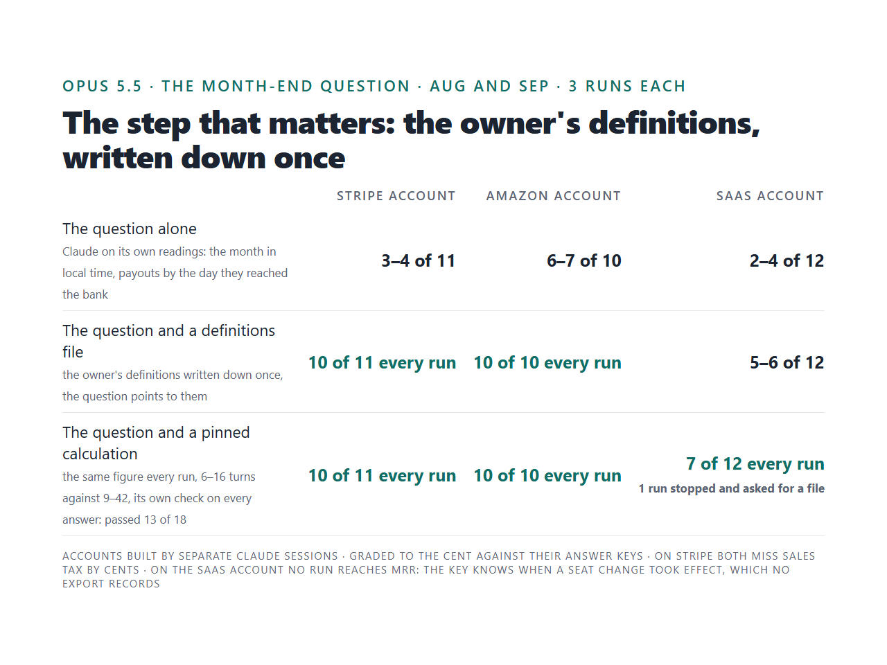

# Numbers Claude gives about your business, with the work shown

*Claude skills for the numbers a business asks every month, from Shopify, Stripe, Amazon or another export,
and for checking the report someone else sends you. Tested on stores and accounts built apart from the skills;
every answer the tables count is published with its grades. Version 1.5, September 2026.*

I set up Claude to answer a recurring numbers question the way the business counts: its definitions asked
once and written down; the calculation pinned; every figure from a script and checked against its results,
an answer that does not match sent back or flagged; anything left out named. I also check the skills and
plugins you already use.

**Tested on nine synthetic datasets: five Shopify stores, a Stripe account, an Amazon seller account, a
subscription business on Stripe Billing, and an agency's report on the Stripe account. Six of them were built by
separate Claude sessions that never saw the skills.**

Four pages, one for each piece of work:

- **[Your definitions, written down once](DEFINITIONS.md)** (a Stripe account, an Amazon seller account and a
  subscription business on Stripe Billing, built apart). Asked the owner's month-end question plainly, Opus matched the owner's own definitions on 3 or 4
  of 11 bookkeeper lines (Stripe) and 6 or 7 of 10 (Amazon), on readings of its own (the month in local time,
  payouts by the day they reached the bank, the reserve inside what is owed). With the definitions written down
  once, in a file or in a pinned calculation, the same plain question gave 10 of 11 and 10 of 10 in every run.
  What the pin adds over a file: the same figure in every run where a file's runs differed by cents, fewer
  turns, the plugin's own check on every answer (on the latest version it passed 10 of 12 and flagged two that
  retold the checked answer shorter or typed a figure), and a refusal to pin a month on incomplete exports until
  the owner decides. On the subscription business (12 lines: MRR, churn, billings, recognised revenue) a file was
  not enough: 5 or 6 of 12 with it, 7 of 12 with the pin in every run that answered, because only the pin
  rebuilt each subscription's status for the month's end (the export gives it for the day it was taken). No run
  reached MRR to the cent: the answer key knows when a seat change took effect, which no export records.
- **[Checking the report you already get](TIEOUT.md)** (an agency's report on the Stripe account, 7 mistakes
  planted by a separate session). The skill gives the same verdicts as plain Opus in every run: 16 of 22
  right, 6 of 7 mistakes caught, the same two arguable readings; neither caught two swapped digits. It is not
  more accurate; what it adds is a checked answer, every figure of the report accounted for (on the latest
  version its own check passed 3 of 3), at about 1.6 times the turns.
- **[The Shopify month-end skills](SHOPIFY.md)** (five Shopify stores). On the first three, the figure on the
  skill's stated definitions in 27 of 27 answers against 13 of 27 without, and everything the owner should see
  named in 27 against 21; as a client installs the plugin, 27 of 27 on 0.11.0 and again on 0.11.6. Store D,
  built apart and used to develop: the scripts' blind run matched 18 of 50 figures, 55 of 56 after. Store E,
  built apart and blind: **the skills did not win**, plain Opus 9 of 9 on the neutral graders against 6 of 9.
- **[A check of Anthropic's free Small Business plugin](https://github.com/5eBeKs/small-business-audit)**, on
  synthetic books: what it found, and what an owner still cannot see.

**Works where the owner is.** The Shopify skills run in claude.ai chat, uploaded as skills: tried there with
Opus 5.5 on store A ([the three answers](live-tests/claude-ai/)); the pinned calculation not yet. Each
answer ends with a seal line: `answer.py --verify` on the saved file shows it was not edited after the check,
not that the figures are right. Team accounts: documented by Anthropic, not tried here.

**Fixed-price work, quoted per export:** your definitions written down and one recurring question pinned on
your export (Stripe, Amazon or another export, quoted first; for Shopify, the Shopify skills with your
definitions file), a check of the report your bookkeeper or agency
sends you, or a check of skills that misfire. [Message me on Upwork](https://www.upwork.com/freelancers/ilyashkura)
with the question you ask Claude and a sample export (test data is fine).

## What you can order

| You have | You get | Evidence here |
|---|---|---|
| A task your team does with Claude every week or month: numbers from an export, a report, a reconciliation | Skills that ask your definitions once, in plain words, and print them under every answer; figures from scripts, checked against the scripts' results; every excluded record named. A plugin for Claude Code (tested here; the 27 runs of the version as installed had its tool server on, and never called it); the Shopify skills in claude.ai chat (tried; the pinned calculation and the tie-out not yet); for a whole team's account and in Cowork (documented by Anthropic, not tried yet) | [What the owner can see](SHOPIFY.md#what-the-owner-can-see) |
| Skills you already have that sometimes do not fire, or fire on the wrong request | Your skills through the skill zoo: `claude plugin validate`, a linter for silent mistakes, and a routing eval on how your people actually ask | [The skill zoo](#the-skill-zoo-does-the-right-skill-run) |
| Answers Claude writes from your data that nobody checks | Your answers with defects planted one at a time, and a record of which layer stops each: the number check, the coverage check, a reviewer model | [The answer zoo](#the-answer-zoo-it-ran-and-the-answer-is-wrong) |

Every model answer and grade is kept and handed over. Contact: [Upwork](https://www.upwork.com/freelancers/ilyashkura).

## What was built

| Skill | The owner's question | What computes it |
|---|---|---|
| `shopify-monthly-summary` | How did the month go? The numbers for my accountant | a script over the orders export |
| `payout-reconciliation` | Why did less reach the bank than we sold? | a script over the orders and the payout transactions: a bridge from card sales to the bank statement that must close to 0.00 |
| `sku-margin-check` | Which products lose money? | a script over the orders and the cost sheet |
| `pinned-calculation` | The same question every month on another system's exports (Stripe, Amazon, a bank), counted my way | the owner's definitions asked once (packs of questions for payment providers and marketplaces), then a calculation, its answer template and its checks pinned in one file the owner keeps, tried on broken copies of the owner's files |
| `report-tie-out` | Are the figures in the report my bookkeeper or agency sent right? | every figure of the report quoted and given a status against a figure computed from the owner's files: matches, does not match, or cannot be confirmed and why |

Around them:

- **Definitions, asked once and shown every time.** A short questionnaire (test orders, when a sale
  counts, VAT, shipping, refunds), answered by the owner in a file a person can read. Every answer
  ends with "How this was counted": each definition in words, marked as the owner's answer or as
  the usual one still to be confirmed, and the files it was computed from (rows and SHA-256) with the
  plugin's version. See [`examples/answer-correct.md`](examples/answer-correct.md). The comparison
  below was made on earlier versions (`22b4986` for stores A and B, `0a61aaa` for store C), before
  the fingerprints and the export check; the same questions on 0.6.0 show both in every answer.
- **Figures from placeholders.** The model writes a draft with placeholders (`{{net_after_refunds|money}}`);
  a renderer fills them from the script's results, lists included, however long. A model can still type a
  figure into its chat answer; the claim map flags it when the hook finds the map (on store D at 0.10.1,
  two answers typed figures and were flagged).
- **The number check.** Every figure in the answer traces to the script's results, every order
  number exists, the currency is the store's.
- **The coverage check.** Everything the results list for the owner is named in the answer: orders
  left out and why, disputes, orders paid outside Shopify Payments, payouts in transit, products
  below cost or without a cost, open questions.
- **The export checked first.** A renamed column stops the script; a new gateway, tag, status or
  currency is named, and orders that are not sales yet are left out with the reason; the answer says
  whether the export covers the month and what it was checked against
  ([The data zoo](#the-data-zoo-the-export-changes)).
- **An answer hook.** An answer that is not the checked text is sent back once; if it fails again,
  the reader is warned. Up to 0.10.1 that warning went wrong in an interactive session; fixed in 0.11.0
  (see [The answer hook](#the-answer-hook)).
- **A tool server** (MCP) with the same scripts, for a place that loads the plugin but has no terminal,
  such as Cowork (not tried yet; the desktop app's Chat tab ignores plugin tool servers). The `claude -p`
  runs here had it off, so the skills ran their scripts; the first comparison's runs on stores A and B
  allowed it, and which path they took was not recorded; the 27 runs of 0.11.0 as installed had it on, with a
  shell, and never called it. And **a linter** for the mistakes that make a
  skill fail without a word.

## How the bench works

Four parts; the full method is in [METHOD.md](METHOD.md), every table in [ZOO.md](ZOO.md).

| Part | What is planted | What is measured |
|---|---|---|
| **Stores** | Three synthetic stores with the traps of real exports, store C at a real store's size; stores D and E, a Stripe account (F) with an agency's report on it, an Amazon seller account (G) and a subscription business on Stripe Billing (H), each built by a separate Claude session that never saw the skills | the scripts against truth computed by each generator from its own records |
| **Models** | The owner's questions on stores A to C, and three more on store D | Opus 5.5 with the skills and without them: the figures, and what the owner can see |
| **Answer zoo** | 24 defects in 7 classes, one per copy of a correct answer | the number check, the coverage check, reviewer models |
| **Skill zoo** | 11 defects in a skill's frontmatter or files, one per copy of the plugin | `claude plugin validate --strict`, the linter, the routing eval |

- **Store A**, an EU tea shop: VAT inside prices, a test order tagged `test`, a PayPal order, a chargeback.
- **Store B**, a US candle shop built to differ: sales tax on top, test orders through Shopify's
  test gateway with no tag, a gift card split, a dispute won, a payout adjustment, a cost sheet
  typed by hand, the previous month's last sales paid out in this one.
- **Store D**, a US clothing store built by a separate Claude session that never saw the skills: four
  currencies, 30,251 orders, 68 traps, its own truth. See [SHOPIFY.md](SHOPIFY.md#store-d-built-apart-used-to-develop).
- **Store E**, a Dutch home goods store, **account F** (Stripe) with **an agency's report** on it,
  **account G** (Amazon) and **account H** (a subscription business on Stripe Billing): each built apart; see [SHOPIFY.md](SHOPIFY.md#store-e-built-apart-blind),
  [DEFINITIONS.md](DEFINITIONS.md) and [TIEOUT.md](TIEOUT.md).
- **Store C**, a UK skincare shop at a real store's size: three months, 4,470 orders, and the
  question is one month. Its owner has answered the definitions: a sale counts once it is shipped,
  revenue is reported without VAT and shipping. So 70 pre-orders, paid and charged, are not
  August sales. Without the skills the model has a shell there and writes its own code.

Not every trap has a grader of its own: VAT inside store A's prices, store B's sales tax and payout
adjustment, and on store C the refunds of July orders, the gift cards and PayPal orders and the cost
sheet's spellings are graded by nothing.

## The answer zoo: it ran, and the answer is wrong

24 defects planted one at a time into correct answers, in seven classes named for what the owner
would get wrong. The number check stops 6, the coverage check 5, and the other 13 go to a reviewer
model, three runs each in a fresh session:

| Layer | Stops |
|---|---|
| Number check (every figure traces to the results) | 6 |
| Coverage check (everything listed for the owner is named) | 5 |
| Sonnet 5 as a reviewer | 13 of the other 13 |
| Opus 5.5 as a reviewer | 13 of the other 13 |
| Nothing | 0 |

On the three untouched answers Sonnet raised no objection in 9 runs; Opus objected in 3 of 9, each time
to something the answer left unsaid or put loosely (whether unshipped orders count; how much VAT the net
still holds). I agree with each. The answers the zoo tests were not changed after this run, so these
objections still stand against them. Earlier reviewer runs, on reference answers since corrected, are
not in the table ([Checking the checks](#checking-the-checks), item 4).

## The skill zoo: does the right skill run

11 defects in the summary skill's frontmatter or files, each in its own copy of the plugin. On this
plugin, routing held up: a vague description, one with no trigger, one that also claims margins, a
wrong name — the summary skill still fired on its question, asked plainly and indirectly (6 of 6), and
stayed out of the margins question. Three defects stop it cold (0 of 6): a misspelled `description`
field, a line before the frontmatter, and `disable-model-invocation: true`. `claude plugin validate`
flags the first two; the third it passes, and so did the linter until the bench showed it (W06).

## The answer hook

The skills say "show the owner exactly the checked text". On store C a model once showed a retelling
instead. A Stop hook in the plugin now holds the rule: when the month-end scripts ran in a turn, the
final message must pass the number check against their results, and anything it leaves out must be in
a checked file it points to; otherwise Claude is sent back once with the list, and if the second answer
fails too, the reader is warned. In live sessions where the owner asked for two sentences and no files,
the hook sent Claude back: once Claude told the owner what the short answer leaves out and offered the
checked version, once it named all 85 orders left out. An answer made to fail twice ended with the
warning, on version 0.4.0 ([`results/hook-check.md`](results/hook-check.md)).

From 0.6.0 the hook checks only the current turn, and up to 0.10.1 it takes its own feedback, which
Claude Code records as a message from the user, for the start of a new turn. So in a session that keeps
a transcript, as an interactive one does, a second failed answer gets the warning that no month-end
script ran, not the one above, and the failed answer is not kept. Fixed in 0.11.0: a turn starts at the
person's own message. The bench's
own runs with the hook kept no transcript and never met this: on 0.5.1, 0.5.2 and 0.6.0 (the nine
questions, three runs each) the hook sent back 5, 4 and 7 first answers of 27, none twice, and every
last answer passed.

## The data zoo: the export changes

A monthly skill breaks in the month the export changes. Eight changes to an export the owner had
confirmed, each run through the scripts before and after the export checks:

| Change | Before | Now |
|---|---|---|
| Two orders paid with a gateway the store never used | silent | named |
| An order tagged 'wholesale' | silent | named |
| An order whose payment is still pending | silent, counted as a sale | named, left out |
| An order with a status the store never had | silent, counted as a sale | named, left out |
| An order in US dollars in a euro store | silent, added to the euro total | named, left out |
| The 'Lineitem price' column renamed | crashed | stopped: "the export has 'Lineitem unit price': renamed?" |
| The export taken on the 20th | silent: a month at half its sales | named: "the export may stop early" |
| A 'reserve' line in the payouts | named | named |

The answer now also says on how many days of the month there are records, and what it was checked
against: the owner's figures from Shopify or the bank, or nothing. Up to 0.10.1 a month with no records
at all gave zeros with no warning, only that line ("records on 0 of 30 days"); from 0.11.0 it is a warning,
and so is a gap inside the month.

## Checking the checks

A bench that only confirms its author proves little. After each model run every failure was read,
and so were the answers the skills got right, except at 0.10.1, where the checks a reader judges were
not read. Each finding changed the tools, not the story:

1. **Graders that failed right answers, twice.** The first patterns failed right answers written
   without the skills (a margin per unit instead of for the month; a payout bridge from every order
   instead of card sales). They became model judges; on the next run the payout judge failed right
   bridges too, so the payout cases went back to patterns that accept every right way to split the
   bridge, tried on the kept answers before the re-run. A test checks that every figure a grader
   looks for appears in the scripts' results or is recounted from the CSV files; it checks that the
   figure is there, not that it is the right one for its grader.
2. **A definition shared by the skill, the truth and the graders.** Store B's truth is computed
   independently of the scripts, but on the same definition: money paid out for this month's
   sales. Opus 5.5 without the skills reconciled to what the bank statement shows, which also holds
   the previous month's last sales, paid out in the first days of this one. It was right; the
   skill's "paid out this month" would not have matched the owner's bank. Independent arithmetic
   is not independent definitions. The bridge now ends at the bank
   ([`results/stores-at-b445df1.json`](results/stores-at-b445df1.json): the old skill against the corrected truth).
3. **A question that said less than the script did.** The questionnaire asked about orders "tagged
   'test'"; the scripts also left out orders paid through Shopify's test gateway. Opus with a shell,
   given store C's answered definitions and no skills, kept four test-gateway orders in the sales
   and asked the owner about them. By the words of the definition it was right. The question now
   names the gateway, and every definition is printed in words under the answer.
4. **Reviewers that were right about the reference answers.** On the first reviewer run, one run per
   answer, Opus 5.5 and Fable 5.1 failed all three untouched answers (the summary: "left after refunds"
   reads as money kept; VAT, shipping and the month basis missing), and Sonnet 5 passed one defect,
   advice to drop a product on one month's data. On the second, Sonnet failed the untouched payout and
   margin answers in 3 of 6 runs (their figures rest on answers the owner has not confirmed, and the
   question reads as cut off from them) and passed that defect in 2 of 3. I agreed, and the reference
   answers and the skills' instructions changed before the final run, the one the table counts. There
   Opus again objected, in 3 of 9 runs, to what the untouched answers leave unsaid or put loosely; I
   agree, and those answers were not changed after it.
5. **A defect nothing static saw.** `disable-model-invocation: true` passes `claude plugin
   validate` and passed the linter, and the skill stopped firing. The linter now warns on it.
6. **Size.** Store C leaves out 85 orders in August; a placeholder names one figure, so lists now
   render whole. The scripts rounded money half to even and one of store C's figures differed from
   its truth by a penny; they now round half up. And a grader that asked for revenue to the penny
   failed right answers that took VAT out of the month's sum instead of order by order (about a pound
   over 1,555 orders); it now accepts two pounds either way.
7. **Right figures under wrong labels, found by a separate audit.** A separate Claude session audited this
   repository's data, recounting from the CSV files, and found what no check here reads: labels.
   Store C's payout answers with the skills called 2,762.41 "refunds on August orders" when 1,093.51
   of it was refunds on July orders processed in August, and one set the gap against the wrong line.
   One such answer is run 1 of store C's payouts question in the comparison above, counted there as
   right and on basis: its graders check the figures, not the words next to them.
   The number check traces figures, not the words next to them. The script now splits refunds by the
   month of the order, and the skill gives the model each line's label word for word. The same audit
   found the number check refusing the skill's own words ("Mineral SPF 50", "VAT at 20%"), which a
   live session got past by hiding product names; that is fixed in 0.5.1. And it found this
   repository's own readings wrong in places, corrected here: a range of orders ("#1998–#2000")
   counted as not naming the middle one.

This is also the answer to "how would you test a system you did not design": plant what the owner
could get wrong, read every failure and every pass, and let what you find change the checks.

## What is in this repository

| Path | What it holds |
|---|---|
| [`DEFINITIONS.md`](DEFINITIONS.md), [`TIEOUT.md`](TIEOUT.md), [`SHOPIFY.md`](SHOPIFY.md) | The three pages above, every figure read from the runs |
| [`ZOO.md`](ZOO.md) | Every table, generated from the results, not edited by hand |
| [`METHOD.md`](METHOD.md) | How each part works, what is published, what the bench is not |
| [`results/`](results/) | The recorded results the pages count: store comparisons, the answer zoo, the skill zoo, the model runs with their grades. Not published: the runs of 0.9.0 and 0.10.1 on stores A to C, two repeat runs of the store C comparison with the same setup (30 sessions), and the earlier reviewer runs |
| [`results/evals/answers/`](results/evals/answers/) | The final answer of every model run the tables count, with the skills and without, next to its grades |
| [`live-tests/`](live-tests/) | The first live tests (Haiku, Sonnet, Opus): 16 answers, unedited, and the figures they were checked against; and the three answers from claude.ai chat (`live-tests/claude-ai/`) |
| [`stores/`](stores/) | Nine datasets: stores A to E, the Stripe account F and the agency's report on it, the Amazon account G, the subscription business H (`stores/stripe_s/`). Their exports, store C's definitions and every answer key (`truth.json`; the report's `key.json`): recount any figure from the files. Store C also has its August books, used by the [small business case](https://github.com/5eBeKs/small-business-audit), not by the comparisons here: QuickBooks Online's transaction list and profit and loss (`qbo_*.csv`), Shopify's list of the month's 21 payouts (`shopify_payouts_aug.csv`), and what a close of those books must find (`ledger_truth.json`) |
| [`examples/`](examples/) | A correct answer with its definitions in words, a plausible wrong one, and what the linter and the number check say |
| [`gallery/`](gallery/) | The case in pictures and a PDF: the definitions on the Stripe and Amazon accounts, where the skills did not win (store E, the report), then stores A to D |

## What this does not claim

- **Not a model ranking.** Three runs per cell show a repeated behaviour, not an error rate; the
  final answer runs are Opus 5.5 only, and Sonnet 5 is one of the answer zoo's reviewers.
- **Not real stores.** The stores are synthetic, with the traps named above. A real store has traps
  nobody planted; finding them is the first week of an engagement.
- **Blind only in parts.** Stores A to C, the planted defects and the graders were written by the same
  person as the skills. Stores D and E, the Stripe and Amazon accounts and the agency's report were each
  built by a separate Claude session that never saw the skills, with its own answer key; the scripts' first
  run on store D and every run on store E were blind, and everything after store D's first run was developed
  on store D. What makes the results checkable is that every answer and grade is kept, and the data and
  answer keys are public.
- **Not a guarantee that a definition is right.** The checks prove a figure came from the script and
  every listed item is named; whether the definition is the owner's is the owner's answer, which is
  why it is printed under every answer.

## The code

The skills, the checks, the tool server and the bench are private: they are the working tool, and a
client's skills are built with it. In an engagement the client gets the skills and checks built for
them, with their tests and eval cases.

Model runs: Claude Code 2.1.280, September 2026 (`claude plugin eval` for the first comparison on stores
A and B, the reviewers and the routing runs; `claude -p` sessions with a shell for store C, store D and
the later versions). The cost figures in the results are the tool's
list-price estimates, not charges.

## License

The text and the data in this repository are under [CC BY 4.0](LICENSE): quote them, recount them,
publish them further, and name the source. The code is not in this repository, and the license does
not reach it. `gallery/case.pdf` embeds subsets of the Segoe UI and Consolas fonts, which are Microsoft's
and not under that license.

Not affiliated with Shopify, Stripe, Amazon, Intuit or Anthropic.
