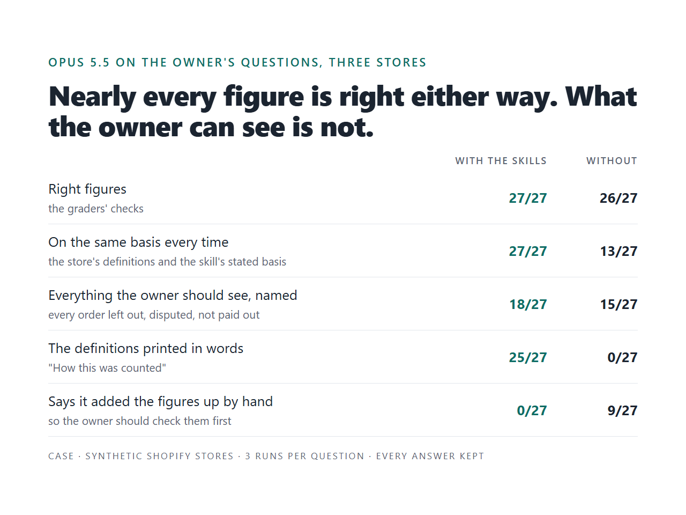

# Claude skills zoo

*Claude skills for a business, where the reader sees what every figure means.*

A strong model rarely gets the arithmetic wrong any more. What goes wrong is the context: which
orders count as sales, whether revenue holds VAT, which month a refund or a payout belongs to. A
wrong or unstated choice there gives an answer that is right as arithmetic and wrong for the
owner, and nothing about it looks wrong.

This repository is the evidence of how I build Claude skills against that, and how I test them.
Three skills for a Shopify store's month-end make every definition visible: each figure comes from
a script, the answer says in words what the figure counts and whose answer that definition is,
every order left out is named with its reason, and every question only the owner can answer is
asked, not guessed. A bench plants defects one at a time and records which check stops each, and
reads every model answer, with the skills and without them, for what the owner can see. Every
result, every model answer and the three test stores' data are here; the skills, the checks and the
bench are not (see [The code](#the-code)).

Opus 5.5 on the owner's questions about three stores, 27 runs with the skills and 27 without; every
answer is kept in [`results/evals/answers/`](results/evals/answers/):

| | with the skills | without |
|---|---|---|
| Right figures | 27/27 | 26/27 |
| On the same basis every time | 27/27 | 13/27 |
| Everything the owner should see, named (orders left out, disputed, not paid out) | 27/27 | 18/27 |
| The definitions printed in words ("How this was counted") | 25/27 | 0/27 |
| Says it added the figures up by hand | 0/27 | 9/27 |

## What you can order

| You have | You get | Evidence here |
|---|---|---|
| A task your team does with Claude every week or month: numbers from an export, a report, a reconciliation | Skills that ask your definitions once, in plain words, and print them under every answer; figures from scripts, checked against the scripts' results; every excluded record named. A plugin for Claude Code, Claude Desktop or Cowork | [What the owner can see](#what-the-owner-can-see) |
| Skills you already have that sometimes do not fire, or fire on the wrong request | Your skills through the skill zoo: `claude plugin validate`, a linter for silent mistakes, and a routing eval on how your people actually ask | [The skill zoo](#the-skill-zoo-does-the-right-skill-run) |
| Answers Claude writes from your data that nobody checks | Your answers with defects planted one at a time, and a record of which layer stops each: the number check, the coverage check, a reviewer model | [The answer zoo](#the-answer-zoo-it-ran-and-the-answer-is-wrong) |

The evals run on your own Claude account. Contact: [Upwork](https://www.upwork.com/freelancers/ilyashkura).

## What was built

| Skill | The owner's question | What computes it |
|---|---|---|
| `shopify-monthly-summary` | How did the month go? The numbers for my accountant | a script over the orders export |
| `payout-reconciliation` | Why did less reach the bank than we sold? | a script over the orders and the payout transactions: a bridge from card sales to the bank statement that must close to 0.00 |
| `sku-margin-check` | Which products lose money? | a script over the orders and the cost sheet |

Around them:

- **Definitions, asked once and shown every time.** A short questionnaire (test orders, when a sale
  counts, VAT, shipping, refunds), answered by the owner in a file a person can read. Every answer
  ends with "How this was counted": each definition in words, marked as the owner's answer or as
  the usual one still to be confirmed, and the files it was computed from (rows and SHA-256) with the
  plugin's version. See [`examples/answer-correct.md`](examples/answer-correct.md).
- **Figures are never typed.** The model writes a draft with placeholders (`{{net_after_refunds|money}}`);
  a renderer fills them from the script's results, lists included, however long.
- **The number check.** Every figure in the answer traces to the script's results, every order
  number exists, the currency is the store's.
- **The coverage check.** Everything the results list for the owner is named in the answer: orders
  left out and why, disputes, orders paid outside Shopify Payments, payouts in transit, products
  below cost or without a cost, open questions.
- **The export checked first.** A renamed column stops the script; a new gateway, tag, status or
  currency is named, and orders that are not sales yet are left out with the reason; the answer says
  whether the export covers the month and what it was checked against
  ([The data zoo](#the-data-zoo-the-export-changes)).
- **An answer hook.** Claude may not finish on an answer that is not the checked text (see
  [The answer hook](#the-answer-hook)).
- **A tool server** with the same scripts, so the skills work without a terminal (Claude Desktop,
  Cowork), and **a linter** for the mistakes that make a skill fail without a word.

## How the bench works

Four parts; the full method is in [METHOD.md](METHOD.md), every table in [ZOO.md](ZOO.md).

| Part | What is planted | What is measured |
|---|---|---|
| **Stores** | Three synthetic stores with the traps of real exports; store C at a real store's size | the scripts against truth computed by each store's generator from its own records |
| **Models** | The owner's questions on the three stores | Opus 5.5 with the skills and without them: the figures, and what the owner can see |
| **Answer zoo** | 24 defects in 7 classes, one per copy of a correct answer | the number check, the coverage check, reviewer models |
| **Skill zoo** | 11 defects in a skill's frontmatter or files, one per copy of the plugin | `claude plugin validate --strict`, the linter, the routing eval |

- **Store A**, an EU tea shop: VAT inside prices, a test order tagged `test`, a PayPal order, a chargeback.
- **Store B**, a US candle shop built to differ: sales tax on top, test orders through Shopify's
  test gateway with no tag, a gift card split, a dispute won, a payout adjustment, a cost sheet
  typed by hand, the previous month's last sales paid out in this one.
- **Store C**, a UK skincare shop at a real store's size: three months, 4,470 orders, and the
  question is one month. Its owner has answered the definitions: a sale counts once it is shipped,
  revenue is reported without VAT and shipping. So 70 pre-orders, paid and charged, are not
  August sales. Without the skills the model has a shell there and writes its own code.

## What the owner can see

The model is not the problem. Opus 5.5 got the figures right in 53 of 54 runs, with the skills or
without them. What changes without the skills is what the owner is shown, and whether it is the same
next month:

- **The basis moves.** For the same margins question Opus led with a loss per unit on store A (€1.64,
  and a month's loss "of about €34" on another basis), the month's loss on store B, and a loss after
  spreading discounts and refunds over products on store C. Each is
  defensible; none is fixed or written down, so next month's answer can differ. For the payouts it
  started, in all six runs on stores A and B, from every order in the export (€3,022.62 and
  $4,335.23), test and cancelled ones included, and explained them away below. With the skills, every answer is on the stated basis (27 of 27).
- **The orders behind the counts go unnamed.** Store C leaves 85 orders out of August's sales and has
  400 payout items to account for. Without the skills Opus named them in none of the six summary and
  payout runs; with them every answer named all of them, in the chat or in the checked file it saved.
- **Own code slips.** Without the skills on store C the model wrote its own code, read the owner's
  definitions file and applied it. In one run of three it labelled a total as after discounts when it
  was before them, and August revenue came out about £1,000 high. The skills' scripts gave the same
  figures in every run.
- **Hand-added figures.** Where it had no shell (stores A and B, like a chat with the file attached)
  Opus said in 9 of 18 answers that it had added the figures up by hand and they should be checked.

Per store: right figures with / without the skills 9/9 and 9/9 (A), 9/9 and 9/9 (B), 9/9 and 8/9 (C);
everything named 9/9 and 9/9 (A), 9/9 and 6/9 (B), 9/9 and 3/9 (C). The full tables are in
[ZOO.md](ZOO.md).

## The answer zoo: it ran, and the answer is wrong

24 defects planted one at a time into correct answers, in seven classes named for what the owner
would get wrong. The number check stops 6, the coverage check 5, and the other 13 go to a reviewer
model, three runs each in a fresh session:

| Layer | Stops |
|---|---|
| Number check (every figure traces to the results) | 6 |
| Coverage check (everything listed for the owner is named) | 5 |
| Sonnet 5 as a reviewer | 13 of the other 13 |
| Opus 5.5 as a reviewer | 13 of the other 13 |
| Nothing | 0 |

On the three untouched answers Sonnet raised no objection in 9 runs; Opus objected in 3 of 9, every
time to a definition the answer left unsaid (whether unshipped orders count; how much VAT the net
still holds), and every objection held.

## The skill zoo: does the right skill run

11 defects in the summary skill's frontmatter or files, each in its own copy of the plugin. On this
plugin, routing held up: a vague description, one with no trigger, one that also claims margins, a
wrong name — the summary skill still ran on its question, asked plainly and indirectly (6 of 6), and
stayed out of the margins question. Three defects stop it cold (0 of 6): a misspelled `description`
field, a line before the frontmatter, and `disable-model-invocation: true`. `claude plugin validate`
flags the first two; the third it passes, and so did the linter until the bench showed it (W06).

## The answer hook

The skills say "show the owner exactly the checked text". On store C a model once showed a retelling
instead. A Stop hook in the plugin now holds the rule: when the month-end scripts ran in a session, the
final message must pass the number check against their results, and anything it leaves out must be in
a checked file it points to; otherwise Claude is sent back once with the list, and if the second answer
fails too, the reader is warned. In live sessions where the owner asked for two sentences and no files,
the hook sent Claude back: once Claude told the owner what the short answer leaves out and offered the
checked version, once it named all 85 orders left out; an answer made to fail twice ended with the
warning ([`results/hook-check.md`](results/hook-check.md)). In six sessions with the owner's usual
message the first answer already passed.

## The data zoo: the export changes

A monthly skill breaks in the month the export changes. Eight changes to an export the owner had
confirmed, each run through the scripts before and after the export checks:

| Change | Before | Now |
|---|---|---|
| Two orders paid with a gateway the store never used | silent | named |
| An order tagged 'wholesale' | silent | named |
| An order whose payment is still pending | silent, counted as a sale | named, left out |
| An order with a status the store never had | silent, counted as a sale | named, left out |
| An order in US dollars in a euro store | silent, added to the euro total | named, left out |
| The 'Lineitem sku' column renamed | crashed | stopped: "the export has 'Lineitem SKU': renamed?" |
| The export taken on the 20th | silent: a month at half its sales | named: "the export may stop early" |
| A 'reserve' line in the payouts | named | named |

The answer now also says on how many days of the month there are records, and what it was checked
against: the owner's figures from Shopify or the bank, or nothing.

## Three stores against independent truth

Each store's generator computes `truth.json` from its own order records, not from the CSV the scripts
read. Now: store A 24 of 24 figures, store B 23 of 23, store C 44 of 44. The skills of earlier commits,
measured against the same truth, show what the bench found: at `ad8b48e` store B got 9 of 21 and store
C 18 of 41; at `b445df1` both ended the payout bridge short of the bank.

## Checking the checks

A bench that only confirms its author proves little. After each model run every failure was read,
and so were the answers the skills got right. Each finding changed the tools, not the story:

1. **Graders that failed right answers, twice.** The first patterns failed right answers written
   without the skills (a margin per unit instead of for the month; a payout bridge from every order
   instead of card sales). They became model judges; on the next run the payout judge failed right
   bridges too, so the payout cases went back to patterns that accept every right way to split the
   bridge, tried on the kept answers before the re-run. A test checks that every figure a grader
   looks for comes from the scripts' results or is recounted from the CSV files.
2. **A definition shared by the skill, the truth and the graders.** Store B's truth is computed
   independently of the scripts, but on the same definition: money paid out for this month's
   sales. Opus 5.5 without the skills reconciled to what the bank statement shows, which also holds
   the previous month's last sales, paid out in the first days of this one. It was right; the
   skill's "paid out this month" would not have matched the owner's bank. Independent arithmetic
   is not independent definitions. The bridge now ends at the bank
   ([`results/stores-at-b445df1.json`](results/stores-at-b445df1.json): the old skill against the corrected truth).
3. **A question that said less than the script did.** The questionnaire asked about orders "tagged
   'test'"; the scripts also left out orders paid through Shopify's test gateway. Opus with a shell,
   given store C's answered definitions and no skills, kept four test-gateway orders in the sales
   and asked the owner about them. By the words of the definition it was right. The question now
   names the gateway, and every definition is printed in words under the answer.
4. **Reviewers that were right about the reference answers.** Opus 5.5 as a reviewer failed the
   untouched summary ("left after refunds" reads as money kept; VAT, shipping and the month basis
   missing); later Sonnet 5 failed the untouched payout and margin answers (their figures rest on
   answers the owner has not confirmed, and the question reads as cut off from them); on the final
   run Opus again objected that the margins never said whether unshipped orders count. Every one of
   these is about a definition left unsaid, and every one held.
5. **A defect nothing static saw.** `disable-model-invocation: true` passes `claude plugin
   validate` and passed the linter, and the skill stopped firing. The linter now warns on it.
6. **Size.** Store C leaves out 85 orders in August; a placeholder names one figure, so lists now
   render whole. The scripts rounded money half to even and one of store C's figures differed from
   its truth by a penny; they now round half up. And a grader that asked for revenue to the penny
   failed right answers that took VAT out of the month's sum instead of order by order (about a pound
   over 1,555 orders); it now accepts two pounds either way.

This is also the answer to "how would you test a system you did not design": plant what the owner
could get wrong, read every failure and every pass, and let what you find change the checks.

## What is in this repository

| Path | What it holds |
|---|---|
| [`ZOO.md`](ZOO.md) | Every table, generated from the results, not edited by hand |
| [`METHOD.md`](METHOD.md) | How each part works, what is published, what the bench is not |
| [`results/`](results/) | Every recorded result: store comparisons, the answer zoo, the skill zoo, every model run with its grades |
| [`results/evals/answers/`](results/evals/answers/) | The final answer of every model run, with the skills and without, next to its grades |
| [`live-tests/`](live-tests/) | The first live tests (Haiku, Sonnet, Opus): 16 answers, unedited, and the figures they were checked against |
| [`stores/`](stores/) | The three stores' exports, store C's definitions and every `truth.json`: recount any figure from the CSV files |
| [`examples/`](examples/) | A correct answer with its definitions in words, a plausible wrong one, and what the linter and the number check say |
| [`gallery/`](gallery/) | The case in pictures and a two-page PDF |

## What this does not claim

- **Not a model ranking.** Three runs per cell show a repeated behaviour, not an error rate; the
  final runs are Opus 5.5 only.
- **Not real stores.** The stores are synthetic, with the traps named above. A real store has traps
  nobody planted; finding them is the first week of an engagement.
- **Not a blind test.** The same person wrote the skills, planted the defects and wrote the graders.
  What makes the results checkable is that every answer and grade is kept, and the stores' data and
  truth are public.
- **Not a guarantee that a definition is right.** The checks prove a figure came from the script and
  every listed item is named; whether the definition is the owner's is the owner's answer, which is
  why it is printed under every answer.

## The code

The skills, the checks, the tool server and the bench are private: they are the working tool, and a
client's skills are built with it. In an engagement the client gets the skills and checks built for
them, with their tests and eval cases.

Model runs: Claude Code 2.1.280 with a subscription login, September 2026 (`claude plugin eval`, and
`claude -p` sessions with a shell for store C). The cost figures in the results are the tool's
list-price estimates, not charges.

## License

The text and the data in this repository are under [CC BY 4.0](LICENSE): quote them, recount them,
publish them further, and name the source. The code is not in this repository, and the license does
not reach it.

Not affiliated with Shopify or Anthropic.
