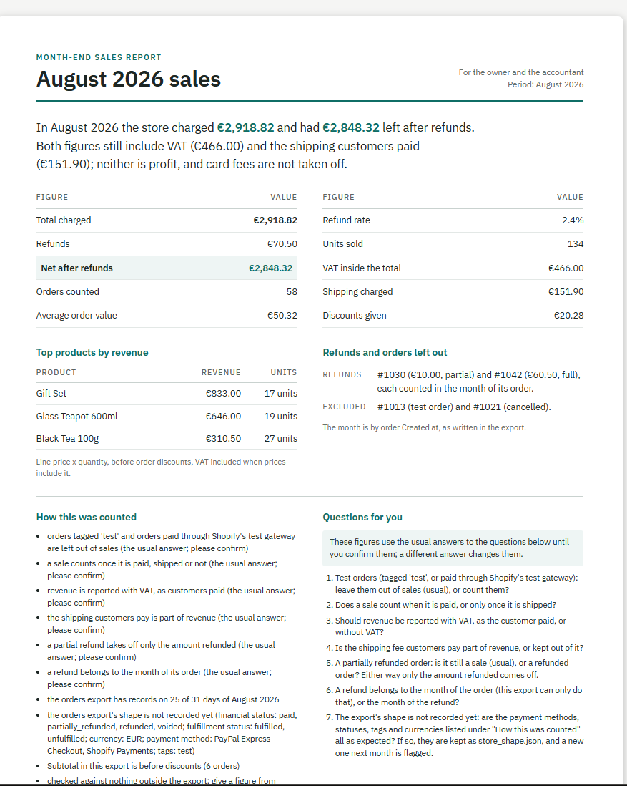

# A report template in Claude Design, built from a checked answer

September 2026. Claude Design (beta, claude.ai), the Document template, Opus 5.5. Attached: store A's checked
August summary as the Shopify skill renders it (`examples/answer-correct.md`, 0.11.7). One request:

> A one-page month-end sales report for a small EU tea shop, for the owner and the accountant, August 2026,
> built from the attached checked summary. Keep every figure exactly as the summary writes it: no figure added,
> rounded, recomputed or dropped, the same labels next to them. Keep the orders left out, the 'How this was
> counted' definitions, the questions for the owner, and the seal line at the bottom word for word. Make it a
> reusable template for every month: a clear hierarchy (the headline figures first, then the table, top
> products, what was left out, how it was counted, questions), print-friendly A4, calm and professional, one
> accent colour (teal #0f6e66).

What came out: one A4 page in that order. Read against the attached summary, the figures on the page are the
summary's own: the ten lines of the table, the three top products with their units, the two refunds and the two
orders left out, each with its label. The definitions and the seven questions are word for word. Claude Design
listed what it changed in the wording and layout: the two fingerprint lines moved to the foot as the "seal line"
(the summary as rendered has no seal of its own), the products' note made a caption, "Questions for you" made a
heading, and four labels it added ("Month-end sales report", "For the owner and the accountant", "Period: August
2026", "Refunds and orders left out"). It then checked its own page, found the page printing as US Letter and
the body in the system font, and fixed both.

What it does not show: the figures were checked by reading the page, not by a script (the page is served from
Claude Design's own domain; the text was not exported); the page's foot, below the part shown above, was not
read. And a design keeps what it is given: the figures are right here because the summary was checked first.
